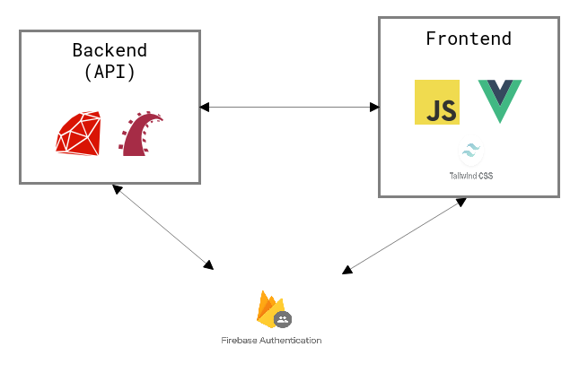

Black (チャットアプリ) - API側
==

Rails と Vue で開発したチャットアプリ  
API（バックエンド）側

主な機能
- ユーザー認証
- ユーザー名変更
- チャットルーム作成
- 入室・退室
- チャット

[フロントエンド側のGitHubリポジトリURL](https://github.com/utouto97/black_front)  
https://github.com/utouto97/black_front

